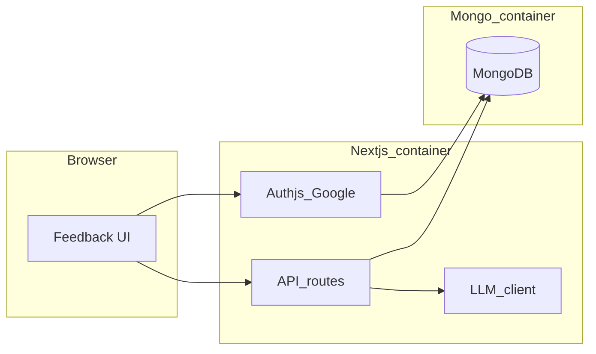

# Feedback app POC: Next.js, Google auth, MongoDB, AI loop

## Current state

The repo is effectively empty aside from [README.md](C:\workspace\feedback_app\README.md) and `[.gitignore](C:\workspace\feedback_app\.gitignore)`. Everything below is net-new.

## Auth choice (Google)

Use **Auth.js (NextAuth v5) with the Google provider** on the vinext App Router. It is the lowest-friction path for “sign in with Google” in vinext: one OAuth app in Google Cloud Console, env vars for client ID/secret, and session handling without building OAuth flows by hand. GitHub OAuth is equally easy later if you add a second provider.

## High-level architecture (POC)

- **User flow**: Sign in with Google → see a minimal “black” shell → submit feedback text → document saved in MongoDB → server calls the LLM with a **fixed system prompt** → result stored on the same document (e.g. `aiPlan` / `status`).
- **API key (POC meaning)**: Besides user auth, expose a **server-only ingest secret** (e.g. `FEEDBACK_INGEST_API_KEY`) so a future agent or script can `POST` feedback with `Authorization: Bearer <key>` without a browser session—useful for the “coding feedback loop” and later GitHub webhooks. UI-submitted feedback stays session-authenticated.

## Stack and layout (proposed)

| Piece      | Choice                                                                                                                                                 |
| ---------- | ------------------------------------------------------------------------------------------------------------------------------------------------------ |
| App        | vinext (App Router) + TypeScript                                                                                                                       |
| Auth       | Auth.js + Google                                                                                                                                       |
| DB         | MongoDB 7.x in Docker; access via **Mongoose** (schemas + validation) or native driver—Mongoose is fine for JSON-ish documents and indexes             |
| LLM        | Start with **OpenAI** (or **Anthropic**) behind `LLM_PROVIDER` + one API key in `.env`; abstract a tiny `lib/llm.ts` so swapping providers is one file |
| Containers | `docker-compose.yml`: services `mongo` and `web`; `web` builds from a **multi-stage Dockerfile** (install, build, run `next start`)                    |

Files to add (illustrative):

- `docker-compose.yml` — `mongo` + `web`, env for `MONGODB_URI`, auth secrets, LLM key, `FEEDBACK_INGEST_API_KEY`
- `Dockerfile` + `.dockerignore`
- `app/` — layout, sign-in page, protected feedback page, dark styling
- `auth.ts` / `auth.config.ts` — Auth.js Google config; Mongo **Adapter** optional in POC (can use JWT sessions first to reduce moving parts; add Mongo adapter when you need server-side session revocation lists)
- `lib/db.ts` — Mongo connection singleton for server
- `lib/feedback.ts` — create feedback, attach LLM output, list for current user
- `app/api/feedback/route.ts` — `POST` for logged-in users; optional `POST` with Bearer key for agent
- `app/api/feedback/[id]/process/route.ts` or server action — runs LLM and updates document (idempotent `status: pending | done | error`)

## Data model (MongoDB)

Example document shape (easy for humans and AI to read/write):

- `userId` (string, from session `sub` or email—tie to Google account)
- `text` (user feedback)
- `createdAt`, `updatedAt`
- `status`, `aiOutput` (string or structured subdocument: `summary`, `proposedSteps`, `risks`, `outOfScope`)
- Optional: `source: "ui" | "api"`

Index: `{ userId: 1, createdAt: -1 }`.

## “Coding feedback loop” in POC scope

**In scope**: Persist feedback → call LLM with **prompt engineering** that forces:

- No claims of having changed production data or repos
- Structured output (JSON schema or strict markdown sections) listing assumptions, risks, and **explicit “do not do”** list (e.g. mass deletes, credential changes)
- Refusal or escalation language for destructive / security-sensitive requests

**Out of scope for first POC** (document in README as Phase 2): cloning a user repo, applying patches, `git push`, GitHub Issues creation, GitHub Actions deploy. The POC proves **auth + storage + API key path + LLM step**; the README/todo will spell the bridge to Issues + Actions.

## Security notes (bake into README)

- Never send Mongo connection string or LLM keys to the client; only server routes call the LLM.
- Validate and cap feedback length; rate-limit `POST` (middleware or simple in-memory counter for POC).
- `FEEDBACK_INGEST_API_KEY` only over HTTPS in production; rotate keys.
- Log redaction for prompts if you add logging later.

## Documentation deliverables

1. **[README.md](C:\workspace\feedback_app\README.md)** — Project goal, architecture diagram (or mermaid), prerequisites (Docker, Google OAuth setup steps), env table (`.env.example`), `docker compose up`, local dev without Docker, security/POC boundaries, roadmap (GitHub Issues, Actions, multi-tenant no-code wrapper).
2. `**TODO.md`** — Phased checklist: POC complete criteria, then adapter/session hardening, GitHub App / Issues webhook, sandboxed codegen runner, etc.

## Verification (after implementation)

- `docker compose up --build` → app serves, Google login works, feedback appears in Mongo, LLM field populates (with valid API key).
- Lint/format pass per project config once ESLint/Prettier are added with `create-next-app`.

## Risk / dependency

Google OAuth requires a **Google Cloud OAuth client** with authorized redirect URI matching Auth.js (e.g. `http://localhost:3000/api/auth/callback/google` for local). Document exact URI in README.