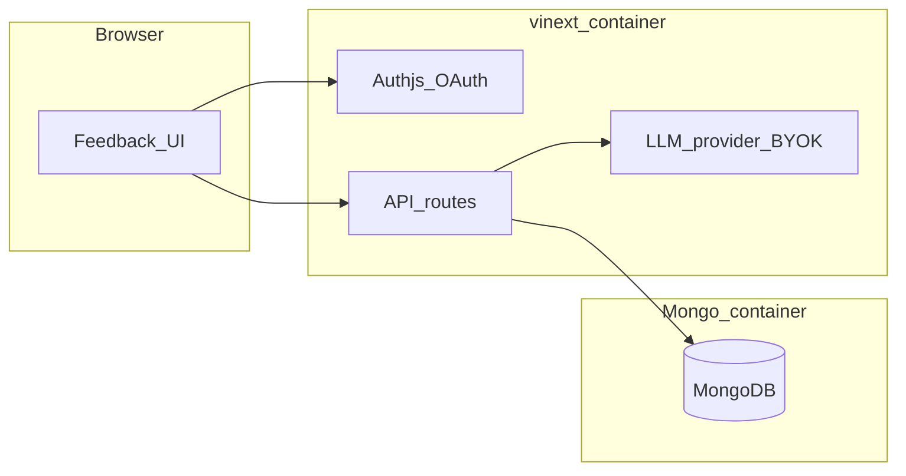

# CYOA

Proof-of-concept: **Google and GitHub sign-in** (Auth.js), **MongoDB** for JSON-friendly feedback records, and a **server-side LLM** step with safety-biased prompting. The app targets **[vinext](https://github.com/cloudflare/vinext)** (Next.js API on Vite) so you can later deploy to **Cloudflare Workers** with `vinext deploy`.

## What this app is for

The long-term product is a **feedback channel between people and an AI builder**: owners, managers, and anyone with product ideas sign in and describe what they want **one piece at a time**—each message is a single, reviewable unit of work for an LLM (and eventually an agent) to turn into app changes. The same flow applies **after** something is built: people **use the product**, hit friction, and submit **bugs or issues** as feedback so the LLM can propose fixes. This repository is the thin shell that proves **identity, storage, and a safe analysis step**; wiring that output to real codegen, GitHub Issues, and deploy pipelines is tracked in [TODO.md](TODO.md).

## What this POC covers

- **Auth**: Sign in with Google or GitHub (`/api/auth/*`) so only trusted people (owner / manager / idea contributors) can submit feedback in the UI.
- **API key path**: Optional `Authorization: Bearer <FEEDBACK_INGEST_API_KEY>` on `POST /api/feedback` with body `{ "userId", "text", ... }` for agents, embedded apps, or future “feedback from the live product” integrations (same optional fields as the UI: `title`, `kind`, `contextWhere`, `contextPage`, `contextSteps`).
- **Coding feedback loop (analysis only today)**: Each submission is stored in MongoDB, then `POST /api/feedback/:id/process` runs an LLM (**OpenAI** or **Anthropic Claude**) with a fixed system prompt and saves structured planning output (summary, steps, risks, guardrails). **Re-analyze** runs the model again on the same ticket and **overwrites** the previous `aiOutput` / `aiRaw` (see UI button when status is `done` or `error`). That JSON is meant to be consumed by a **downstream builder**—not executed blindly inside this service. **No git push, no GitHub Issues, no auto-deploy** in this repo (see [TODO.md](TODO.md)).
- **Health**: `GET /api/health` returns `{ ok: true, mongo: "skipped" }`. Use `GET /api/health?mongo=1` to verify MongoDB connectivity (returns 503 if `MONGODB_URI` is missing or the server cannot connect).
- **Misconfiguration**: Feedback and process routes return **503** with `{ missing: [...] }` when required env vars are absent (e.g. `MONGODB_URI`, `LLM_API_KEY` for process).

## Architecture



Today the browser UI is this service itself; later, the same APIs can accept feedback from **your** app (bugs) or from **internal** tools (feature requests), still **one ticket per message**.

## Prerequisites

- **Node.js 22.12+** locally (`package.json` `engines`). The **Dockerfile** uses **Node 24**.
- Docker and Docker Compose (for the two-container setup).
- A [Google Cloud](https://console.cloud.google.com/) OAuth 2.0 Client (Web application) and/or a [GitHub OAuth App](https://github.com/settings/developers).
- An LLM API key: [OpenAI](https://platform.openai.com/) and/or [Anthropic](https://console.anthropic.com/) (Claude), depending on `LLM_PROVIDER`.

### Google OAuth setup (Client ID + secret)

Auth.js expects **`AUTH_GOOGLE_ID`** and **`AUTH_GOOGLE_SECRET`** in `.env` (see [`auth.ts`](auth.ts)). The redirect URL must match **exactly** what Google Cloud lists (scheme, host, port, path).

1. Open [Google Cloud Console](https://console.cloud.google.com/) and select or **create a project**.
2. Go to **APIs & Services** → **OAuth consent screen**.
   - Choose **External** (any Google account can test) unless you’re on Workspace and want **Internal**.
   - Fill required fields (app name, user support email, developer contact), **Save and continue** through scopes (defaults are fine for “Sign in with Google”), then add **test users** if the app stays in **Testing** (only those accounts can sign in until you publish).
3. Go to **APIs & Services** → **Credentials** → **Create credentials** → **OAuth client ID**.
4. Application type: **Web application**. Give it a name (e.g. `feedback_app local`).
5. **Authorized JavaScript origins** — add the origin of your app (no path):
   - Local: `http://localhost:3000`
6. **Authorized redirect URIs** — add the Auth.js callback (must include `/api/auth/callback/google`):
   - Local: `http://localhost:3000/api/auth/callback/google`
   - Production: `https://your-domain.com/api/auth/callback/google`
7. Click **Create**. Copy **Client ID** → `AUTH_GOOGLE_ID`, **Client secret** → `AUTH_GOOGLE_SECRET` in `.env`.
8. Set **`AUTH_URL`** to that same origin (e.g. `http://localhost:3000`). Mismatched `AUTH_URL` vs redirect URI is a common “redirect_uri_mismatch” cause.
9. Set **`AUTH_SECRET`** (e.g. `openssl rand -base64 32`). Required for session encryption.

**Note:** You do **not** need to enable a special “Google+ API” for basic sign-in; the OAuth client + consent screen are enough. If Google shows “access blocked” or “app not verified,” add your Gmail as a **test user** on the consent screen while in Testing mode.

### GitHub OAuth setup (optional if you only use Google)

1. Open [GitHub → Settings → Developer settings → OAuth Apps](https://github.com/settings/developers) (use a **GitHub OAuth App**, not necessarily a full GitHub App for basic sign-in).
2. **New OAuth App**. **Homepage URL**: your app origin (e.g. `http://localhost:3000`).
3. **Authorization callback URL**: `{AUTH_URL}/api/auth/callback/github` (e.g. `http://localhost:3000/api/auth/callback/github`).
4. After creation, copy **Client ID** → `AUTH_GITHUB_ID`, generate a **Client secret** → `AUTH_GITHUB_SECRET` in `.env`.

**Auth.js `UnknownAction` / “Unsupported action” on sign-in:** Auth.js **rejects GET** on `/api/auth/signin/:provider` by design; OAuth must start with **POST** (with CSRF). The buttons use **`next-auth/react` `signIn()`**, which POSTs via `fetch`. If you still see this error, check the provider’s **callback URL** in Google/GitHub: it must be **`…/api/auth/callback/<provider>`**, not `…/signin/<provider>`. Set **`AUTH_URL` to the site origin only** (e.g. `http://localhost:3000`); [`auth.ts`](auth.ts) sets `basePath: "/api/auth"` and [`app/providers.tsx`](app/providers.tsx) passes the same path to `SessionProvider`.

## Environment variables

Copy [.env.example](.env.example) to `.env` and fill in values.

| Variable | Purpose |
|----------|---------|
| `MONGODB_URI` | Mongo connection string |
| `AUTH_SECRET` | Auth.js secret (long random string) |
| `AUTH_URL` | Public origin of the app (used for OAuth) |
| `AUTH_GOOGLE_ID` / `AUTH_GOOGLE_SECRET` | Google OAuth |
| `AUTH_GITHUB_ID` / `AUTH_GITHUB_SECRET` | GitHub OAuth |
| `LLM_PROVIDER` | `openai` (default) or `anthropic` (alias: `claude`) — picks which HTTP/SDK path runs |
| `LLM_API_KEY` | API key for that vendor (never sent to the browser) |
| `LLM_MODEL` | Optional; if unset, defaults to `gpt-4o-mini` (OpenAI) or `claude-3-5-haiku-20241022` (Anthropic) |
| `FEEDBACK_INGEST_API_KEY` | Optional Bearer token for programmatic `POST /api/feedback` |

Secrets are **server-side only**. **Settings** (in the app) can store an **encrypted LLM API key** and optional **GitHub PAT + default `owner/repo` + base branch** per signed-in user (same `AUTH_SECRET`-derived encryption as the LLM key). Env vars remain the fallback for LLM when no user key exists.

Only route handlers call the LLM and MongoDB.

## Example prompts (copy-paste)

Use **one ticket per message**. Tweak titles and context to match your product.

**Greenfield / feature slice**

- Title: `Export dashboard to CSV`
- Intent: **Feature / change**
- Details: `Add a button on the main dashboard that exports the current filtered table to CSV. First slice: export visible columns only; no server-side pagination export yet.`

**Bug while using the app**

- Title: `Billing page spins forever`
- Intent: **Bug / broken behavior**
- Details: `After I click "Update card", the page never finishes loading.`
- Where / environment: `Staging, Chrome 134, Windows 11`
- Screen or page: `Settings → Billing`
- Steps to reproduce: `1) Go to Billing 2) Click Update card 3) Submit test card …`

## HTTP API (POC)

| Method | Path | Notes |
|--------|------|--------|
| `GET` | `/api/health` | Liveness; add `?mongo=1` to ping MongoDB |
| `POST` | `/api/feedback` | Session cookie or Bearer ingest key; JSON body see UI network tab |
| `PATCH` | `/api/feedback/:id` | Session; `{ "title" }` only (strict) updates title; full body `{ "text", optional context… }` updates a **pending** draft only |
| `DELETE` | `/api/feedback/:id` | Session; **pending** drafts only |
| `POST` | `/api/feedback/:id/process` | Run or re-run LLM; overwrites prior analysis on success |
| `POST` | `/api/feedback/:id/github-issue` | Session; requires **approved** plan + GitHub PAT + default `owner/repo` in Settings; creates an issue with the plan |
| `POST` | `/api/feedback/:id/apply` | Session; codegen + write files on server + lint/tsc/test (experimental) |

## Run with Docker Compose

1. Create `.env` (see `.env.example`). Required for compose: `AUTH_SECRET`, `AUTH_GOOGLE_ID`, `AUTH_GOOGLE_SECRET`, and **`LLM_API_KEY`** (from OpenAI or Anthropic depending on `LLM_PROVIDER`).
2. Start (or use `npm run docker:up` / `make up`):

```bash
docker compose up --build
```

3. Open [http://localhost:3000](http://localhost:3000), sign in, go to **Feedback**, and submit one message at a time (e.g. a new feature slice or a bug you saw in the product). The UI saves the item then calls **process** to fill the structured AI fields.

- **MongoDB** is exposed on `localhost:27017` for debugging.
- Set `FEEDBACK_INGEST_API_KEY` in `.env` to try agent-style ingest:

```bash
curl -s -X POST http://localhost:3000/api/feedback \
  -H "Authorization: Bearer YOUR_INGEST_KEY" \
  -H "Content-Type: application/json" \
  -d "{\"userId\":\"GOOGLE_SUB_OR_INTERNAL_ID\",\"text\":\"Ship dark mode\",\"kind\":\"feature\",\"title\":\"Dark mode\"}"
```

Then `POST http://localhost:3000/api/feedback/<id>/process` with the same Bearer header.

## Local dev (no Docker)

Run MongoDB locally, set `MONGODB_URI` in `.env`, then:

```bash
npm install
npm run dev
```

Use `npm run dev:next` / `npm run build:next` if you want the stock Next.js toolchain alongside vinext.

```bash
npm test              # Vitest unit tests (rate limit + LLM JSON parsing helpers)
npm run deps:update   # print outdated deps (npm-check-updates); add -u to write package.json
npm run docker:up     # docker compose up --build
npm run docker:down   # docker compose down
npm run docker:logs   # docker compose logs -f web
```

Equivalent: `make up`, `make down`, `make logs` if you use the included `Makefile`.

**Tooling:** `npm run deps:update` runs [npm-check-updates](https://github.com/raineorshine/npm-check-updates). React is **19.x** with caret ranges; core app deps were already on latest npm versions at upgrade time. ESLint stays on **v9** because **eslint-config-next** 16.2.x’s bundled React plugin is not compatible with ESLint 10 yet.

## GitHub Actions

[`.github/workflows/ci.yml`](.github/workflows/ci.yml) runs on pushes and PRs to `main` / `master`: **lint**, **TypeScript**, **Vitest**, and **`npm run build`** (vinext). Use this as the **required status** for branch protection and (optionally) **auto-merge** when all checks pass.

## Deploying to Cloudflare (vinext)

This app targets **[vinext](https://github.com/cloudflare/vinext)** so it can run on **Cloudflare Workers** with the Next.js App Router surface.

1. Install and log in: **`npm i -g wrangler`** (or use `npx`) and run **`wrangler login`**.
2. From the repo root, follow the current **[vinext deployment guide](https://vinext.io/)** (e.g. **`vinext deploy`** when your project is wired for Workers). Vinext may generate or expect Worker config alongside your build; check the version you have pinned in `package.json`.
3. Set **secrets / vars** in the Cloudflare dashboard (or via `wrangler secret put`): at minimum **`AUTH_SECRET`**, **`AUTH_URL`**, OAuth client IDs/secrets, **`MONGODB_URI`**, and any server LLM vars if you are not relying only on per-user keys. **MongoDB** must be reachable from Workers (e.g. **MongoDB Atlas**); long-lived TCP patterns may need **Hyperdrive** or a compatible data layer as vinext/Workers constraints evolve.
4. **Heavy automation** (full `git clone`, large codegen, or long CPU) often does **not** belong on the same Worker as the HTTP app. Practical split: CYOA does **planning + API** on the edge, and **PR creation** runs in **GitHub Actions** (workflow_dispatch or `repository_dispatch`) or a **small Node service** with a normal filesystem, triggered by webhook or queue. Add **Cloudflare Queues** + a consumer only if you need durable background work with backpressure.

## Integration ideas (PRs and bots)

- **GitHub Copilot / other agents:** CYOA can stay the **human + LLM planning** layer; automation can open issues or PRs via the GitHub API using the **PAT stored in Settings** (once wired), or using a **repo-level `GITHUB_TOKEN`** in Actions for org-owned flows.
- **Anthropic “issue resolver” style flows:** One lightweight pattern is: CYOA **writes the approved plan + context into a GitHub Issue** (body or comment), then an external **issue-driven resolver** (Claude or another product) picks up that issue. You avoid duplicating resolver logic inside CYOA; your job is a **stable issue format** and labels.
- **Extra Workers:** Only add more Workers (or Durable Objects) when you have a concrete need: **webhooks**, **scheduled sweeps**, or **queue consumers**. Otherwise **GitHub Actions** is simpler for git + CI-shaped work.

## Security notes (POC)

- Cap on feedback length (8000 chars) and simple per-key rate limits on API routes.
- LLM prompt instructs **no** claims of deployments/repo changes; structured output includes **doNotDo** and **risks**.
- Use **HTTPS** and rotate `FEEDBACK_INGEST_API_KEY` and `LLM_API_KEY` in production; rely on **authorization checks** in every future automation path.

## Proxy (auth gate)

Protected routes use Next.js 16 **[`proxy.ts`](proxy.ts)** (not deprecated `middleware.ts`) to redirect unauthenticated users away from `/feedback`.

## License

See [LICENSE](LICENSE).
